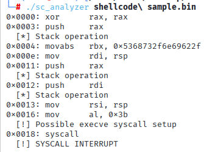
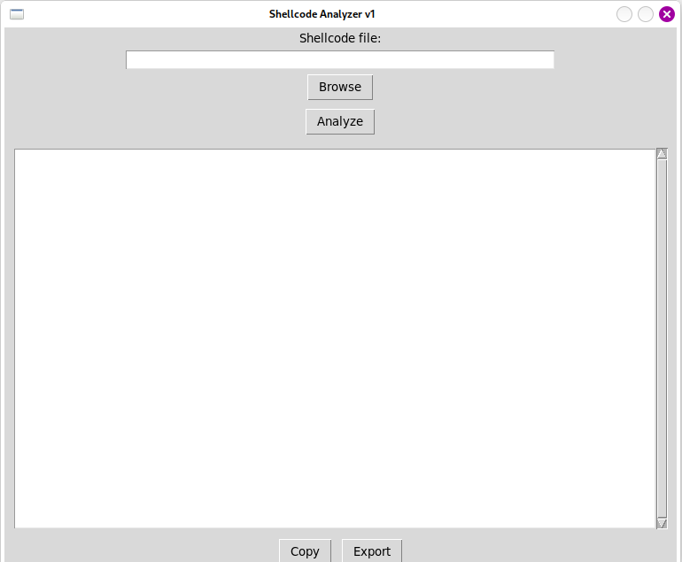

# Shellcode-analyzer

## requirements
OS:Linux (Unix-like)
Tkinter (python3-tk)

## Tested on Linux Debian

## Install on Arch Linux
sudo pacman -S python tk

## install on Fedora
sudo dnf install python3 python3-tkinter

## Project structure:
├── sc_analyzer        # C core analyzer

├── scgui.py            # Python GUI frontend

└── samples.bin         # Example shellcode .bin files

## Cli mode
./sc_analyzer shellcodesample.bin
Supports .bin and .dat raw shellcode files

## GUI mode
Python3 scgui.py 

## install the requirements and then compile the source code 

## Arch Linux 

sudo pacman -S gcc capstone

## Fedora 

sudo dnf install gcc capstone capstone-devel

## Debian / Ubuntu 

sudo apt install build-essential libcapstone-dev

## compile gcc scanalyzer.c -o sc_analyzer -lcapstone

## ./sc_analyzer shellcodesample.bin

## ⚠️​ The analyzer performs static analysis only.
## Shellcode is never executed.
